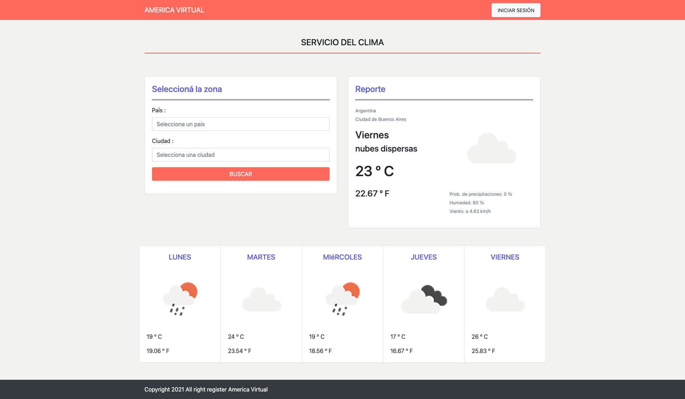

## Tecnologias utilizadas

Para desarrollar este proyecto se han utilizado las siguientes tecnologias:
 - Framework Laravel 7.29.
 - MySQL.
 - Carbon - Una simple extensión de la API de PHP para DateTime.
 - Guzzle - Es un cliente HTTP de PHP que facilita el envío de solicitudes HTTP y simplifica la integración con los servicios web.
 - Bootstrap.
 - jQuery.

## Instalación

Los pasos para realizar la instalación son los siguientes:

- git clone
- composer update
- importar la base de datos (ubicada en el root del directorio)
- php artisan serve

## Datos de acceso
- Email: admin@admin.com
- Password: 123456789 

